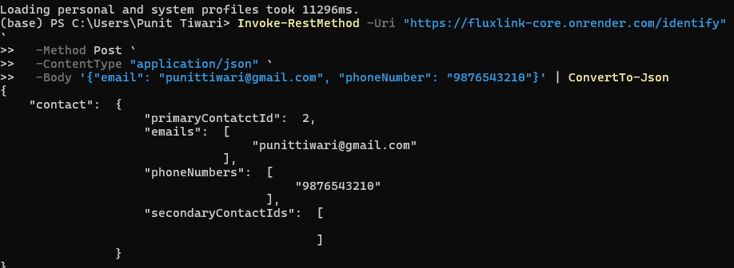
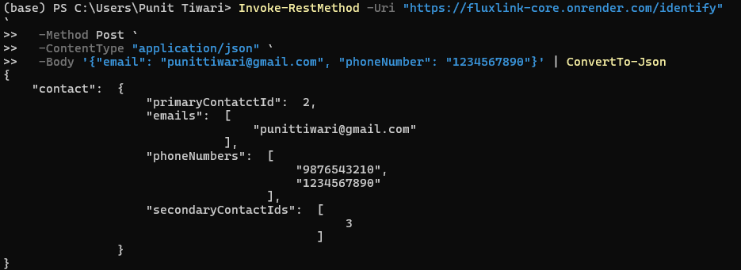
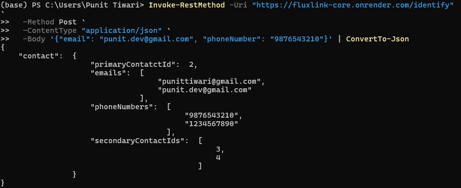
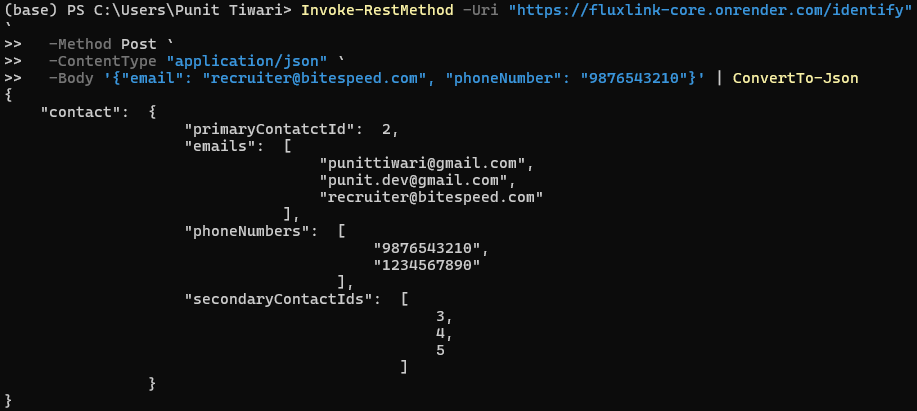

# FluxLink_Core

A smart identity resolution engine designed to connect the dots between fragmented customer data. Instead of creating duplicate profiles, FluxLink_Core recognizes when different orders belong to the same person—even if they use a new email or phone number—and organizes everything into a single, consolidated "Source of Truth."

## 🚀 How it Works
When a new order comes in, the system follows a logical "Detective" process:
1. **Search**: It checks the database for any existing records matching the email or phone number.
2. **Link**: If a match is found, it links the new information as a **Secondary** record to the original **Primary** account.
3. **Merge**: If a request links two previously separate people, the engine "merges" them, demoting the newer primary record to secondary to keep the history clean.

## 🛠️ Tech Stack
- **Runtime**: Node.js (with ESM support)
- **Language**: TypeScript (using ts-node for execution)
- **Database**: SQLite3 (chosen for its speed and zero-config portability)
- **Framework**: Express.js

## 📊 System Output Proof
Below is a step-by-step demonstration of the Identity Resolution engine in action.

### 1. Initial Primary Contact Creation
The system creates a new primary record when no existing email or phone is found.


### 2. Linking via Email (Secondary)
When a request comes with an existing email but a new phone number, it is linked as a secondary record.


### 3. Linking via Phone (Secondary)
When a request comes with an existing phone but a new email, it is also consolidated.


### 4. Primary to Secondary Merge (Master Test)
The system identifies when two previously independent primary contacts should be merged into one, converting the newer primary to secondary.



## 📦 Local Setup
1. **Install dependencies**:
   ```bash
   npm install
   ```
2. Launch the Service:
   ```bash
   npm run dev
   ```
3. Test the Endpoint:
The service listens for POST requests at http://localhost:3000/identify.


## 🌐 Live API Endpoint
The service is deployed and live at:
`https://fluxlink-core.onrender.com/identify`
> **Note**: This service is hosted on a free instance. If the first request takes a few seconds to respond, the server is likely "waking up" from sleep mode.
